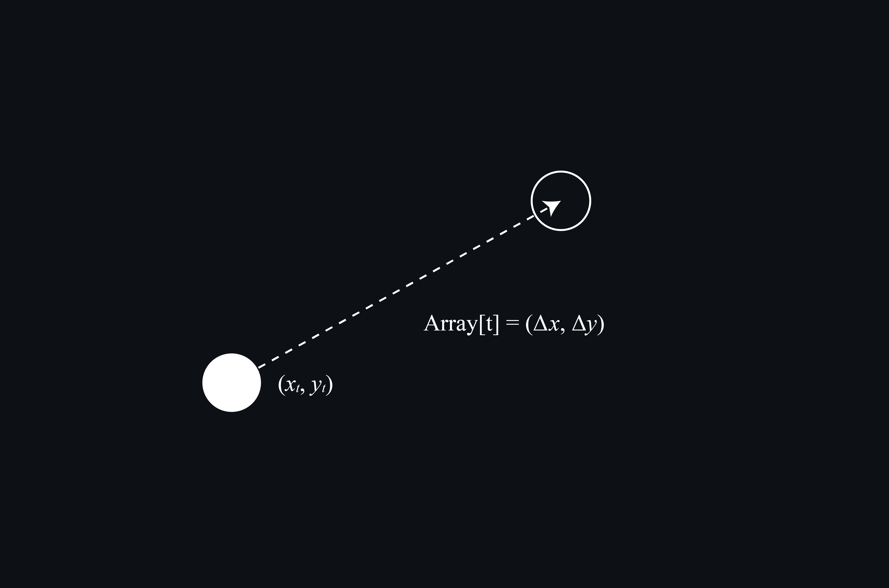
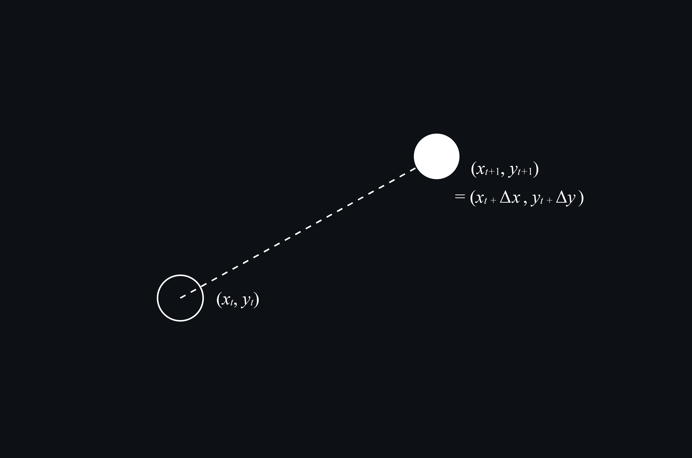
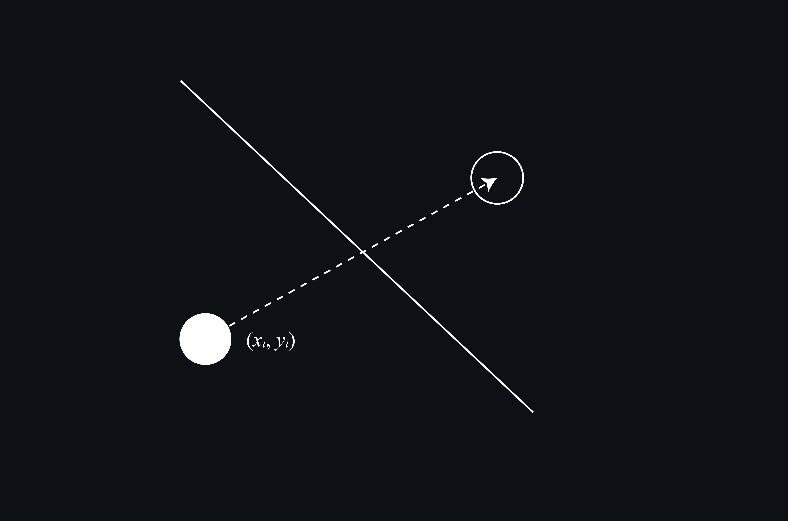
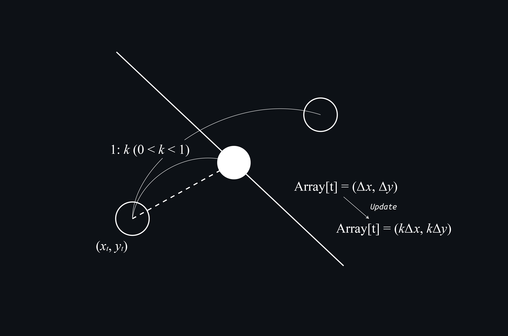
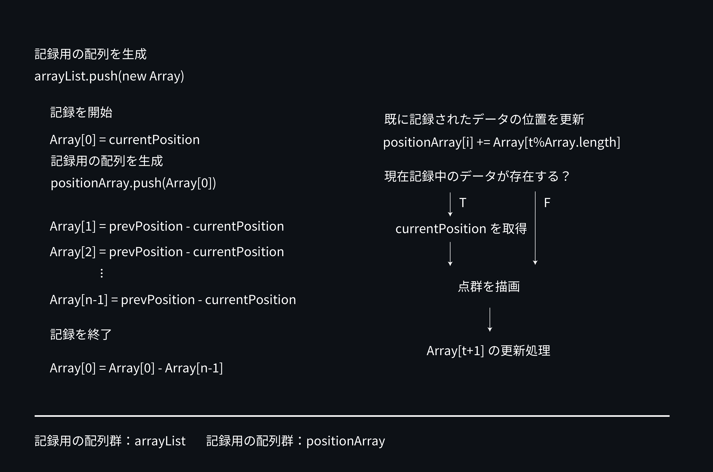

記録されたキーポイントを後から更新するための処理が複雑だったので、ここにメモを残しておく。

キーポイントの更新処理を取り扱う配列には、直接その座標が保存されているのではなく、次のフレームでどこに移動するのか？という移動先の情報が登録されている。

そのため、次のフレーム情報が必要な場合は現在の座標に配列の(x,y)座標を加算することで取得できる。

さて、ここでは移動先に至るまでの経路に障壁があって移動できなかった場合にどのように更新処理が行われるのかについて説明する。

この場合、ここでは現在の点を開始点とした移動ベクトルを、定数 k(0<k<1)倍したもので更新することで、障壁の位置まで移動することで移動を止めるように修正する。

こうした処理の積み重ねで次の位置が決まるため、差分を取得するための処理や更新処理は少しクセがある。以下にそのフローを示すので、適宜参照してほしい。

